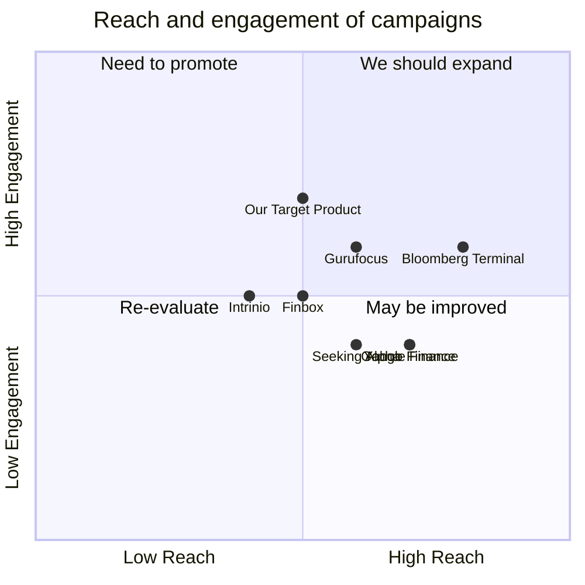

## Original Requirements
The boss has asked to create a program that can calculate a publicly traded company's Weighted Average Cost of Capital (WACC) based on 10K filings or other available information. The program should be developed using Python.

## Product Goals
```python
[
    "Create a Python program that can calculate a company's WACC",
    "The program should be able to extract necessary information from 10K filings",
    "Ensure the program is user-friendly and efficient"
]
```

## User Stories
```python
[
    "As a financial analyst, I want to input a company's 10K filing and get the WACC so that I can analyze the company's financial health",
    "As a user, I want the program to handle errors gracefully so that I can trust the results",
    "As a user, I want to be able to use the program without extensive technical knowledge so that I can focus on financial analysis",
    "As a user, I want the program to be fast and efficient so that I can get results quickly",
    "As a user, I want the program to provide clear and concise output so that I can easily understand the results"
]
```

## Competitive Analysis
```python
[
    "Bloomberg Terminal: A comprehensive financial analysis tool, but expensive and requires training to use",
    "Yahoo Finance: Provides financial data but does not calculate WACC",
    "Google Finance: Similar to Yahoo Finance, provides data but no WACC calculation",
    "Finbox: Provides WACC calculation but requires a subscription",
    "Gurufocus: Provides WACC calculation as part of a larger suite of tools, may be more than needed",
    "Intrinio: Provides financial data APIs, but requires technical knowledge to use",
    "Seeking Alpha: Provides financial data and analysis, but no WACC calculation"
]
```

## Competitive Quadrant Chart


## Requirement Analysis
The product should be a Python program that can calculate the WACC of a publicly traded company. It should be able to extract the necessary data from a company's 10K filings or other available information. The program should be user-friendly, efficient, and provide clear and concise output.

## Requirement Pool
```python
[
    ("Create a function to calculate WACC", "P0"),
    ("Implement a method to extract data from 10K filings", "P0"),
    ("Design a user-friendly interface", "P1"),
    ("Implement error handling", "P1"),
    ("Optimize the program for efficiency", "P2")
]
```

## UI Design draft
The program will be a command-line interface (CLI) application. The user will input the path to a 10K filing, and the program will output the calculated WACC. The interface will be clean and minimalistic, with clear instructions and error messages.

## Anything UNCLEAR
There are no unclear points.