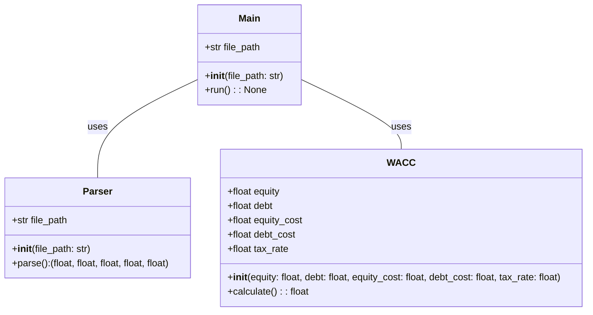
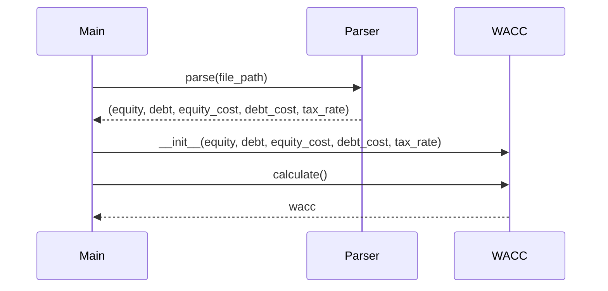

## Implementation approach
The main challenge of this project is to extract the necessary data from the 10K filings. We will use the open-source library BeautifulSoup to parse the HTML of the 10K filings. For the calculation of WACC, we will use the formula: WACC = (E/V) * Re + (D/V) * Rd * (1 - Tc). We will implement a function to calculate each component of this formula. The user interface will be a simple command-line interface, where the user can input the path to a 10K filing. We will use the argparse library to handle command-line arguments. For error handling, we will use Python's built-in exception handling mechanisms. To optimize the program for efficiency, we will use the cProfile module to identify bottlenecks and optimize them.

## Python package name
```python
"wacc_calculator"
```

## File list
```python
[
    "main.py",
    "wacc.py",
    "parser.py",
    "exceptions.py"
]
```

## Data structures and interface definitions


## Program call flow


## Anything UNCLEAR
The requirement is clear to me.